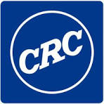

<h1 align="center">Teaching Computers to Read:

*The Code Companion*</h1>

  

     <a href="https://www.routledge.com/Teaching-Computers-to-Read-Effective-Best-Practices-in-Building-Valuab/Wagner-Kaiser/p/book/9781032484372">Check out the book on CRC Press</a>
  

     <a href="https://www.amazon.com/dp/1032484357?ref_=cm_sw_r_ffobk_cp_ud_dp_41EW7J0HBY9A9G8A1GCP_3&bestFormat=true">Check out the book on Amazon</a>
  

 

This repository will serve as the official code companion to the upcoming book "Teaching Computers to Read: Effective Best Practices in Building Valuable NLP Solutions".

**Expected Release**: November 5, 2025  
**Author**: [Dr. Rachel Wagner-Kaiser](https://www.linkedin.com/in/rawagnerkaiser/), with contributions from [Tim Cerino](https://www.linkedin.com/in/timcerino/)

Fill out this [Google form](https://forms.gle/2zpqHBU1M7hkWLrR6) to sign up for the email list.
